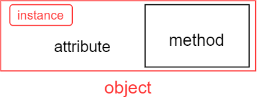

## Classes in C++ (continue)

### Reference vs Pointer

A reference is a type of variable that acts as an alias (unique) to another object or value.

Reference seem like a pointer. But they have some difference:

* Reference can not be NULL.
* Reference  must be initialized when declared.
* Reference can not be reassigned.
* Pointer can have multiple levels, but reference can't.
* Pointer have void*, but reference doesn't have.

```C++
uint32_t u32 = 123; 
uint32_t &r_u32 = u32; // References must be initialed when declared
// The ampersand (&) doesn't mean “address of”, it means “reference to”.

uint32_t another_u32 = 999;
r_u32 = another_u32; // References can not be reassigned 
// this line actually assigns the value of another to u32 (1)

// Let's check it out
cout<<"value of u32"<<r_u32;	
// If (1) right, value of u32 = 999
// else, u32 still = 123
```

References are generally much safer to use than pointers (since there’s no risk of indirection through a null pointer). However, they are also a bit more limited in functionality accordingly.

If a given task can be solved with either a reference or a pointer, the reference should generally be preferred. Pointers should only be used in situations where references are not sufficient (such as dynamically allocating memory).

---

### New vs Malloc

**new** is an specific operator in C++.  **malloc()** is a C library function, can be use in C++.

Both **new** and **maloc()** are used  to allocate the dynamically memory in heap. But when **new** is used, it call the constructor of a class, whereas **malloc()** does not.

---

### Delete vs Free

**delete** is a keyword in C++. **free()** is a C library function that can also be used in C++.

**delete** frees memory create by **new** and calls destructor of a class. But **free()** only frees memory create by **malloc() **

```C++

#include <iostream>
using namespace std;
 
class A {
    int a;
public:
    int* ptr;
	A() // Constructor of class A
    {
		cout << "Constructor was called!"
			 << endl;
	}
	~A() // Destructor of class A
	{
		cout << "Destructor was called!"
			 << endl;
	}
};
 
int main()
{
	A* a = new A;
	cout << "Object a was created using \"new\""
 		 << endl;
 	delete(a);
    cout << "Object a was deleted using \"delete\""
 		 << endl;
    cout << endl;   
	A* b = (A*)malloc(sizeof(A));
	cout << "Object b was created using malloc()"
		 << endl;
    free(b);
    cout << "Object b was deleted using free()"
 		 << endl;
	return 0;
}
```

---

### Call method by Object or Instance



```c++
#include <iostream>
using namespace std;
 
class calculate {
    int a;
    int b;
public:
    calculate(int x, int y)
    {
		a = x;
		b = y;
    }
    int add()
    {
        return a+b;
    }
    int sub()
    {
        return a-b;
    }
};
int main()
{
    calculate cal_1(10, 9);
    calculate* ptr_cal_2 = new calculate(150, 50);

    // Call method using object
	cout <<"sum of 10 and 9 is: "<<cal_1.add()
		 <<endl;
    // Call method using instance
	cout <<"sub of 150 and 50 is: "<<ptr_cal_2->sub()
		 <<endl;
	return 0;
}

```

---

### Links references:

**References in C++: ** [www.geeksforgeeks.org/...](https://www.geeksforgeeks.org/references-in-c/)

**Reference variables: ** [www.learncpp.com/...](https://www.learncpp.com/cpp-tutorial/references/#:~:text=A%20reference%20is%20a%20type,ll%20discuss%20in%20this%20lesson.)

**new vs malloc() and free() vs delete in C++: ** [www.geeksforgeeks.org/...](https://www.geeksforgeeks.org/new-vs-malloc-and-free-vs-delete-in-c/#:~:text=malloc()%3A%20It%20is%20a,%E2%80%9Cmalloc()%E2%80%9D%20does%20not.)

