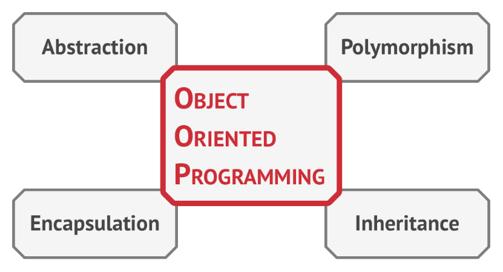
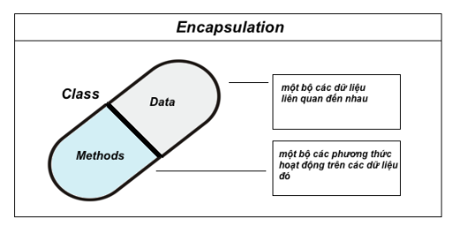
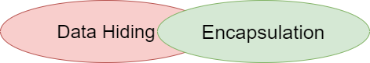
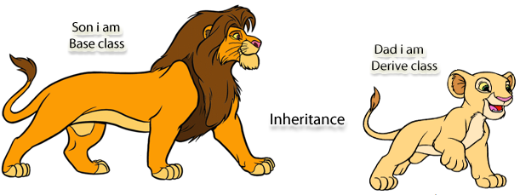

# 																																																**Classes** in C++

### 																															OOP

- OOP stands for Object-Oriented Programming.

- Classes and objects are the two main aspects of object-oriented programming.

  ​	
  
  
  
  


---

#													Classes Syntax

> ```c++
> //car.h
> class Car {        // The class
> private:        // Access specifier
>         string brand;  // Attribute
>         string model;  // Attribute
>         int year;      // Attribute
>         Car(string x, string y, int z); // Constructor declaration
>         ~Car();//Destructor declaration
>         //static void staticMethod(){
>         //void unstaticMethod;
>    };
>    
> // Constructor definition outside the class
> Car::Car(string x, string y, int z) {
>    	brand = x;
>        model = y;
>        year = z;
>    }
>    
> 
> ```
> 
> ```c++
>//car.cpp
> #include <iostream>
>    #include "car.h"
> using namespace std;
> int main() {
>      // Create Car objects and call the constructor with different values
>         Car carObj1("BMW", "X5", 1999);
>         Car carObj2("Ford", "Mustang", 1969);
>         //Car::staticMethod();
>         //Car.unstaticMethod();
>    
>         // Print values
>     	 cout << carObj1.brand << " " << carObj1.model << " " << carObj1.year << "\n";
>         cout << carObj2.brand << " " << carObj2.model << " " << carObj2.year << "\n";
>         return 0;
>    }
>    ```
>    

- Everything in C++ is associated with classes and objects, along with its attributes and methods. Attributes and methods are basically **variables** and **functions** that belongs to the class.

* Declaring Objects: When a class is defined, only the specification for the object is defined; no memory or storage is allocated. To use the data and access functions defined in the class, you need to create objects.
* There are two ways to define functions that belongs to a class:

    * Inside class definition
    * Outside class definition
* Access modifier

    * Public: All the class members declared under the public specifier will be available to everyone.
    * Private:  The class members declared as *private* can be accessed only by the member functions inside the class.  
    * Protected:  Is similar to private access modifier in the sense that it can’t be accessed outside of it’s class unless with the help of friend class, the difference is that the class members declared as Protected can be accessed by any subclass(derived class) of that class as well. 

----

# 									Pillars of OOP

*  Object-oriented programming is based on four pillars, concepts that differentiate it from other programming paradigms.  





---

### 																										Abstraction

* Abstraction is one of 4 general characteristics in OOP, it focuses only on the features of the object and hides unnecessary information. It helps you focus more on the features rather than how it is done. 

  

* Example: When you go to draw some money at an ATM, you do not care about how the ATM works or the components in the ATM, the only thing that you care about is the drawing feature. In this case, the unnecessary information of the ATM is hidden, which is abstraction.


---

​	

### 																 																									Encapsulation

* Encapsulation is a process of combining data members and functions in a single unit called class. This is to prevent the access to the data directly, the access to them is provided through the functions of the class.  

* How the encapsulation is achieved in a class

  *  Make all the data members private 
  * Create public setter and getter functions for each data member in such a way that the set function set the value of data member and get function get the value of data member.

  

  

  > ```c++
  > #include <iostream>
  > using namespace std;
  > 
  > class Employee {
  >   private:
  >         // Private attribute
  >         int salary;
  > public:
  >        void setSalary(int s) {
  >           salary = s;
  >         }
  >         int getSalary() {
  >           return salary;
  >         }
  >     };
  >     int main() {
  >         Employee myObj;
  >         myObj.setSalary(50000);
  >         cout << myObj.getSalary();
  >         return 0;
  >    }
  > ```
  > 
  >- The `salary` attribute is `private`, which has restricted access.
  > - The public `setSalary()` method takes a parameter (`s`) and assigns it to the `salary` attribute (salary = s).
  > - The public `getSalary()` method returns the value of the private `salary` attribute.


* Data hiding and encapsulation both are the important concept of object oriented programming.



| BASIS FOR COMPARISON |                         DATA HIDING                          |                        ENCAPSULATION                         |
| :------------------: | :----------------------------------------------------------: | :----------------------------------------------------------: |
|        Basic         | Data hiding concern about data security along with hiding complexity. | Encapsulation concerns about wrapping data to hide the complexity of a system. |
|        Focus         | Data Hiding focuses on restricting or permitting the use of data inside the capsule. | Encapsulation focuses on enveloping or wrapping the complex data. |
|   Access Specifier   | The data under data hiding is always private and inaccessible. |    The data under encapsulation may be private or public.    |
|       Process        |        Data hiding is a process as well as technique.        |        Encapsulation is a sub-process in data hiding.        |

---


### 																																																Inheritance

* Inheritance is the ability to build new classes on top of existing ones. The main benefit of inheritance is code reuse. If you want to create a class that’s slightly different from an existing one, there’s no need to duplicate code. Instead, you extend the existing class and put the extra functionality into a resulting
  subclass, which inherits fields and methods of the superclass. 

* We group the "inheritance concept" into two categories:

  * **base class** (parent) - the class being inherited from

  * **derived class** (child) - the class that inherits from another class

    

    

* To inherit from a class, use the `:` symbol.

  > ``` c++
  > // Base class 
  > class Vehicle {
  >       public:
  >        string brand = "Ford";
  >        void honk() {
  >        cout << "Grusss, gruss! \n" ;
  >        }
  > };
  > // Derived class
  > class Car: public Vehicle {
  >    public:
  >        string model = "Bently";
  >    };
  > int main() {
  >    	Car myCar;
  >    	myCar.honk();
  >        cout << myCar.brand + " " + myCar.model;
  >        return 0;
  >   }
  >   ```

---

### 																																					Polymorphism

* Polymorphism means "many variants", and it occurs when we have many classes that are related to each other by inheritance.

> ```c++
> //Compile Time Polymorphism
> #include <iostream>
> using namespace std;
> 
> class PrintData {
>    public:
>          void print(int i) {
>            cout << "Printing int: " << i << endl;
>         }
> 
>     void print(double  f) {
>            cout << "Printing float: " << f << endl;
>         }
> 
>     void print(char* c) {
>            cout << "Printing character: " << c << endl;
>         }
>  };
> 
> int main(void) {
>          PrintData pd;
>          pd.print(5);// Call print to print integer
>          pd.print(500.263);// Call print to print float
>          pd.print("Hello C++");// Call print to print character
>          return 0;
> }
> ```
>
> ```c++
> // Runtime Polymorphism
> #include <iostream>
> using namespace std;
> 
> class Pet {
>    protected:
>    	  string Name;
>    public:
>    	 Pet(string n) { Name = n; }
>     	 virtual string getSound() { return "";};
>     	 void makeSound(void) { cout << Name << "says: " << getSound() << endl; }
> };
> 
> class Cat : public Pet {
>    public:
>    	  Cat(string n) : Pet(n) { }
>    	  string getSound() { return "Meow! Meow!";};
> };
> 
> class Dog : public Pet {
>    public:
>    	Dog(string n) : Pet(n) { }
>    	string getSound() { return "Woof! Woof!";};
> };
> 
> int main(void) {
>        Pet *a_pet = new Cat("Kitty");;
>        a_pet->makeSound();
>        delete a_pet;
>        a_pet = new Dog("Doggie");
>        a_pet->makeSound();
>        delete a_pet;
>        return 0;
> }
> ```
>

---

