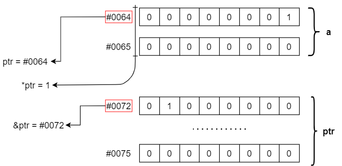

## Pointer

### Introduction



Pointer is the special data type in C. It store address of another variables.  Address of variable is the instruction for computer access to that variable. 

```c
syntax to declare:  datatype* pointer_name;
example:            uint8_t* u8_ptr;
					float*   f32_ptr;
```

Pointers have 2 special operator: * and &

```c
uint8_t* ptr1;
uint8_t foo = 99;

ptr1 = &foo; // &foo is get the address of foo
printf("%d", ptr1); //  This funtion print out address of foo
printf("%d", *ptr1); // *ptr1 is get the value of foo. It's will print out "99"

*ptr1++;
printf("%d", foo); // value of foo is 100 now.
```

Using pointer with string is more interesting:

```c
char str[]="Hello World";
char *s_ptr;
s_ptr = str; // or s_ptr = str[0];
printf("First character is:%c\n",*s_ptr);

s_ptr = s_ptr+1;
printf("Second character is:%c\n",*s_ptr);
printf("Printing all the characters in a string\n");

s_ptr = str;  //reset the pointer

for(int i=0; i<strlen(str); i++) {
	printf("%c",*s_ptr);
	s_ptr++;
}
```

Size of pointer depend on CPU architecture. In **ARM 32-bit**, size of pointer is 4 bytes. 

**Quiz:** But why pointer of different type has only one size?

**Answer:** Because pointer only store address of variable, and that address has integer form. So different size of value have one size of address. 

---

### Dangling Pointer

A pointer pointing to a memory location that has been deleted (or freed) is called dangling pointer. There are **three** different ways where Pointer acts as dangling pointer

#### De-allocation of memory

```c
int* ptr = (int*)malloc(sizeof(int)); // Get one area with int-size in heap memory. 									//And save that address to ptr
*ptr = 12345;
free(ptr); // delete that memory area. ptr becomes dangling now

printf("%d", *ptr); // It will print out garbage value, not equal 12345.

```

#### Out of scope { }

```c
#include <stdio.h>
int *ptr;
void funct(int arg1, int arg2){     //this is inside of scope
       int sum = arg1+arg2;         //this is inside of scope
       ptr = &sum;            //this is inside of scope
   } 
int main()
{
    int a=45, b=54;
    funct(a,b);
    printf("a + b = ",*ptr); // Here ptr is dangling pointer
    //It will print out garbage value.
    //Because sum is local variable, and 
    //goes out of scope after an execution of funct();
    return 0;
}
```

In order to fix this problem, we can define sum as static variable: 

```c
static int sum = arg1+arg2;
```

---

### NULL Pointer and Wild Pointer

NULL Pointer is a pointer which is pointing to nothing. In case, if we don’t have address to be assigned to a pointer, then we can simply use NULL.

Wild Pointer is a pointer which has been declare but not been initialized to anything.

```c
int* i_ptr = NULL; // NULL Pointer
char* c_ptr; // Wild Pointer
char a = 'A'
c_ptr = &a; // c_ptr is not a wild pointer now
```

---

### Void Pointer

Void pointer is a specific pointer type – void * – a pointer that points to some data location in storage, which doesn’t have any specific type. Basically the type of data that it points to is can be any. And must be mention (type-casting) when define that pointer or when we access to value in void pointer. 

```c
void* v_ptr;
float var_f32 = 9.5f;
v_ptr = &var_f32;

printf("%f", *v_ptr); // this funtion will have error
//Because compiler doesn't know size of value to print out.

printf("%f", *((float*)v_ptr) ); // It's print out 9.50000
```

Apply void pointer to function:

```c
#include<stdio.h>

typedef enum {
    INT, //0
    FLOAT, //1
    STRING, //2
}type_e;
void function(void* ptr, type_e type) {
    int* i_ptr = NULL;
    float* f_ptr = NULL;
    char* s_ptr = NULL;
    switch(type) {
        case 0:
          i_ptr = (int*)ptr;
          break;
        case 1:
          f_ptr = (float*)ptr;
          break;
        case 2:
          s_ptr = (char*)ptr;
          break;
    default:
        break;
    }
    // do some thing with those _ptr
}
int main() {
    char str[] = "Hello World";
	int s32 = 9999;
	float f32 = 4.74f;
    function((void*)str, STRING);
    function((void*)s32, INT);
    function((void*)f32, FLOAT); // errorrrrrrrrrrrrrrrrrrr
    return 0;
}
```

---

### Using pointer with struct

```c
#include <stdio.h>

typedef struct {
	unsigned int width;
    unsigned int height;
}rectangle_ts
    
int main() {
    rectangle_ts rect1;
    rectangle_ts rect2;
    rect1* ts_ptr; 
    //do not declare struct pointer like this: 'rectangle_ts ts_ptr;'
    
    (*ts_ptr).width = 40; // call to element in struct by pointer
    ts_ptr->height = 30; // beside that, you can using '->'
    
    rect2 = *ts_ptr;
    printf("rectangle height is: %u\n", rect1.height);
    // It will print out: "30"
    printf("rectangle width is: %u\n", rect1.width);
    // It will print out: "40"
    return 0;
}
```

### Links Reference

**Pointers in C and C++:**[ www.geeksforgeek.org/...](https://www.geeksforgeeks.org/pointers-in-c-and-c-set-1-introduction-arithmetic-and-array/)

**Dangling, Void , Null and Wild Pointers:**[ www.geeksforgeek.org/...](https://www.geeksforgeeks.org/dangling-void-null-wild-pointers/?ref=rp)

**Pointer in C programing:** [ www.guru99.com/...](https://www.guru99.com/c-pointers.html)