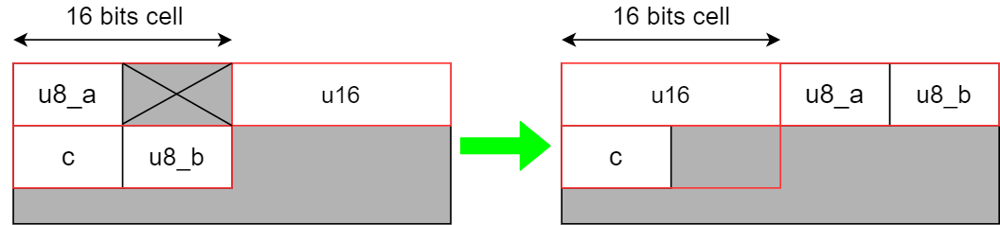
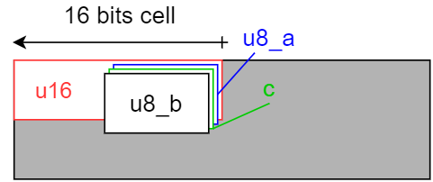

## Struct and Union

### Struct

Struct is container in C that allows to combining standard data types.

Defining and using a struct:

```c
#include <stdio.h>
struct student_st {     // student_st is a type
	char first_name[10]; // field
	uint32_t stu_id;     // field
    float score;         // field
} stu1 = {"An", 123456, 7.86f};
// stu1 is a variable name
// Add more student: stu2, stu3
struct student_st stu2 = {"Binh", 234567, 8.99f};
struct student_st stu3 = {"Chau", 345678, 10.00f};

int main() {
    float class_average = (stu1.score + stu2.score + stu3.score)/3;
    printf("Average score of all student in class: %5.2f", class_average);
    return 0;
}
```

---

### Union

Union is a special data type in C that allows storing different data types in the same memory location. 

To define a union, you must use the **union** statement in the same way as struct.

```c
union union_type {
	int a;
    float b;
} union_name1;
union union_type union_name2;
// and using also like struct:
union_name1.a = 99;
union_name2.a = union_name1.a * 2;
```

The difference between struct and union is **data alignment**.

---

### Struct alignment and Union alignment

Struct align data in serial. Pick from top field to bottom. Size of cell depend on the biggest field. In alignment, if cell's vacancy can't fit next data field, compiler will unused it and allocate new cell next.



```c
struct foo_st {
    uint8_t u8_a;  // top field
    uint16_t u16;// biggest size field: 16 bits
    char c;
    uint8_t u8_b;
} st_var;
// In order not to waste memory, 
//we should place field descending follow to its size.
struct foo_st {
    uint16_t u16;
    uint8_t u8_a;
    uint8_t u8_b;
    char c;
} st_var;
```

Union just locate all field in one cell whose size equal to biggest field:



If we change data in one field of union, all field also be change.

```c
union foo_un {
	uint16_t u16;// biggest size field: 16 bits
    uint8_t u8;
    char c;
    uint8_t u8_b;
} un_var;
```

---

### Bit field

In C, we can shorten field's size (in bits) of structure and union.

```c
struct date_st {
    unsigned int day :5; 
    // Although size of unsigned int is 32 bits
    // In this case, size of day is 5 bits.
    // 1 to 31 can fill in 5 bits
	unsigned int month :4;
    //1 to 12 can fill in 4 bits
    unsigned int year;
} day_var;
```

Bit field can be use to fill the vacancy in memory:

```c
struct foo_st {
    uint16_t u16;
    uint8_t u8_a;
    uint8_t u8_b;
    char c;
    uint8_t hole[hole_size]; // It is useless now, 
    //but may be useful in the future.
} st_var;
```

---

### Nesting struct

```c
struct class_st {
    struct student_st {
        char first_name[10];   
        uint32_t stu_id;
        float score;  
    } student;
 	struct teacher_st form_tchr;  
    uint8_t num_of_stu;
} class1;
struct teacher_st {
	char first_name[10];
    char subject[10];
    uint32_t tchr_id;
} teacher;
```

---

### Struct mixing with Union

Using this way, we can build virtual register:

```c
union register_un {
	struct data_st {
    	int bit0 :1;
        int bit1 :1;
        int bit2 :1;
        int bit3 :1;
        int bit4 :1;
        int bit5 :1;
        int bit6 :1;
        int bit7 :1;
	} data;
    uint8_t value;
} reg1;

// write data into reg1
reg1.data.bit1 = 1;	// reg1.value |= 0x01<<1
reg1.data.bit3 = 1; // reg1.value |= 0x01<<3
..gán thanh ghi hệ thống............................
// read data from reg1
printf("%d", reg1.value); // reg1 = 00001010 = 10;
// It will print out: 10
```

---

### Typedef Struct

As you know, when define struct variable we need firstly typing "struct". We can using typedef to reduce that syntax.

```c
struct struct_type var_name;
// shorten syntax, easy for reuse
typedef struct {
    unsigned float width;
    unsigned float height;
}rect_tst;

rect_tst rect1;
rect_tst rect2;
```

---

### Links reference

**Structure and Union in C: **[www.geeksforgeeks.org/...](https://www.geeksforgeeks.org/difference-structure-union-c/)

**Bits field in C: ** [www.geeksforgeeks.org/...](https://www.geeksforgeeks.org/bit-fields-c/)