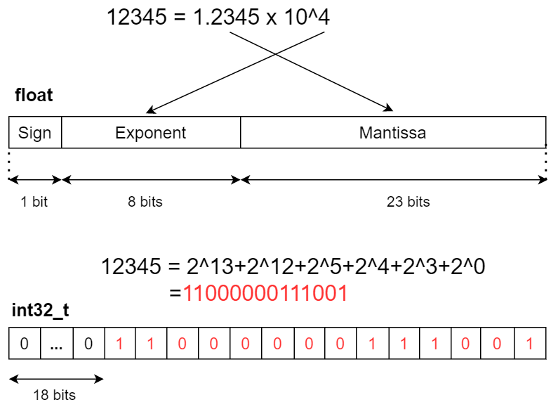

## Variable and Type

### Recommend of naming

```c
#include "stdint.h"

#define UART_TXD_PINNUM (10) // all caps for constant

int32_t mpu_rollAngle_s32; // global variable have type information: _u32(uint32_t), _f32(float)...

void robot_response(int32_t id_command, uint8_t *message) {
    int32_t angle; // local variable
}; // name of variable and function write in lower case. Multiword is linked by "_"

typedef struct {
 ....  
} foo_tst; // _t => typedef and _st => struct
struct {
 ....
} foo_st; // _st => struct
typedef enum {
 ....   
} foo_e; // _e => enum
```

---

### Data type in C

​    Have 3 main groups:

* Integer: Integer variable is used to store _binary-number_ (convert from _decimal-number_).
    

* Floating point numbers, compare to integer number:

  

  

  Type range:

  

  

* String type:

  Base on array of chars (uint8_t), and each element store integer value which stand for each character in ASCII table.
  

  

[Decimal ASCII Chart]: www.asciichart.com

---

### Assignment

Include 2 types:

#### 		Implicit assignment

When you assign variable in the same group of type. The assignment from integer variable to floating point also implicit. Because in this case, compiler has specific function to define it.

Moreover assignment from bigger-size to smaller-size data type also implicit, so it is possible for implicit assignment to lose information.

#### 		Explicit assignment

When you assign variables with type casting,  from different group of data types. And it is user define.

```c
int <== unsigned int // Implicit assignment
long long <= int // Implicit assignment
double <== float // Implicit assignment
float <== int // Implicit assignment
    
int a;
float b;
char c = (char)(a + 10); // Explicit assignment
a = (int)b;  // Explicit assignment
```

**Quiz:** 

```c
int32_t var_s32 = 2012345678; // max of this type is 2147483647
float var_f32 = var_s32;
```

Does the program have error? And does the value of _var_f32_ equal to _var_s32_?

**Answer:**

**No**, it doesn't. And the value of var_f32 is **not equal** to _var_s32. Because of feature of floating point. The integer number stored in **32 bit** memory must convert to **23 bit** (size of mantissa) in float type. In this case, **2012345678** take more than **23 bit** in integer memory . So the data after convert will be lose a bit and difference from value in _var_s32_.

----

### Declare and Define

**Declare ** of a variable is for informing to the compiler the following information: name of the variable, type of value it holds and the initial value if any it takes.

**Define** of a variable says where the variable gets stored. That is memory for the variable is allocated during the definition of the variable. _Declare_ and _define_ can take places at the same time.

```c
unsigned int foo; // Declare a variable
foo = 999; // Define a variable

int add(int arg1, int arg2); // Declare a function
int add(int arg1, int arg2) {
return arg1 + arg2;
}// Define a function
```

-------

### Number literal

_The values_ you give to variable when defining, are implicit in some standard type .  This is called  _**non-suffix**_, ex: int, double,...

```c
int int_var = 8; // 8 ==> int (default)
float pi = 3.14 // 3.14 ==> double (default)
```

So, if you want define those _values_ with another data type, you must add **suffix**:

```c
long long a = 3210123456789LL; // LL ==> long long
unsigned long b = 1234567890123456789ul; //ul or lu are all accepted ==>unsigned long
float pi = 3.14f; // f ==> float
// suffix does not case sensitve. F = f, ul = UL
```

----

### Signed and unsigned number

This is how the signed number is located in memory: _two's complement_


**Quiz:**

```c
uint8_t var_u8 = -1;
printf("%u", var_u8); // %u for unsigned value
```

What is the result was print?

_**Answer:**_

Negative numbers are stored as _two's complement_:


Besides, _var_u8_ is **unsigned** variable, it just understand data like unsigned number.  So the answer is 2^8-1 = 0xFF -maximum number of _uint8_t_.

----

#### Link Reference

**Data Type in C:**[ www.geeksforgeeks.org/...](https://www.geeksforgeeks.org/data-types-in-c/)

**Type Conversion in C:**[ www.geeksforgeek.org/...](https://www.geeksforgeeks.org/type-conversion-c/)