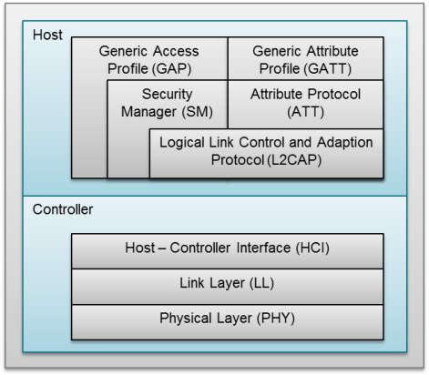
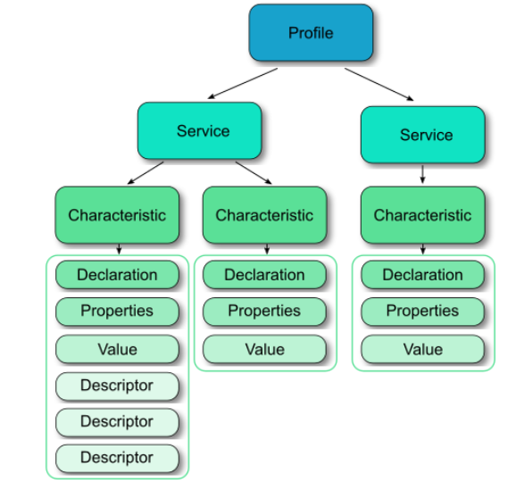

# Bluetooth Low Energy (BLE)

# Intro to BLE

## what is Bluetooth Low Energy(BLE)?


- BLE is low-power wireless technology used for connecting devices with each other.
- BLE is targeted more towards application that need to consume less power.

## Stack's BLE



### Physical Layer(PHY)

- Bluetooth Low Energy shares some similarities with classic Bluetooth. Both use the 2.4 GHz band.
- There are 40 channels defined, each with a width of 2MHz.
  There are two types of channels:
  _ advertising channels (channel 37,38,39)
  _ data channels.(channel 0-36)
- The advertising channels are used for device discovery, broadcasting messages, and setting up connections.


### Link Layer(LL)

- Handling the states of Advertising, Scanning, Create connection and maintenance.
- It is also responsible for the structure of the packets.


- Standby: It does not transmit or receive packets, also known as the idle state.
- Scanning: It listens to advertising packets
- Initiating: It listens to advertising packets and responds to initiate a connection with another device.
- Connected: This state can be accessed from either the Scanning or Initiating state. Two roles are defined:
  - Master role: When accessed from Initiating state.
  - Slave role: When accessed from Advertising state.

**Example**:\
Device A (smartphone) acts as a `Scanner`. It listens to **advertising** packets from other BLE devices, including Device B (temperature sensor) acting as an `Advertiser`.

Device B (temperature sensor) acts as an `Advertiser. It broadcasts advertising packets to announce its presence and the services it provides.

After Device A (smartphone) discovers Device B (temperature sensor) through the scanning process, it can `initiate a connection` with Device B through the Master role. Once the connection is established, Device A (smartphone) will act as the `Master`, while Device B (temperature sensor) will act as the `Slave``.

# Generic Access Profile (GAP)

## GAP roles

### Broadvaster and observer


### Central and Peripheral


- GAP and Link layer differences

  - Each Gap role provides a specific set of requierments to the Link Layer.
  - Implementations of the rules which are laid out by the gap for a particular role is taken care of by the Link Layer.
    <br>

  

  - Link Layer advertising package include Gap package.
    <br>

  

In short:


## Advertising

- During the Advertising state, advertising packets are **periodically** sent on each of the three advertising channels
- The formula for the interval of time between sending advertising packets is:
  ` Interval Time = Fixed Interval + Random Delay`
  
- This random delay helps reduce collisions between advertising packets from different devices

**note**:

- Fixed Interval, this value greatly impacts battery life and must be chosen very carefully
- it's recommended to choose the longest advertising interval that can still satisfy an acceptable user experience

Example:

```C
esp_ble_adv_params_t adv_params = {
    .adv_int_min = 0x20, // Minimum time between two advertising events (32 * 0.625 ms = 20 ms)
    .adv_int_max = 0x40, // Maximum time between two advertising events (64 * 0.625 ms = 40 ms)
    .adv_type = ESP_BLE_ADV_TYPE_IND, // Advertising type: non-connectable and scannable
    .own_addr_type = BLE_ADDR_TYPE_PUBLIC, // Public address of the current device
    .channel_map = ADV_CHNL_ALL, // Use all BLE channels for advertising
};
```

### Packet data structure

When sending packets, beacons can be configured to a variety of standards,
such as: iBeacon, Eddystone, AltBeacon.


Example:

- Raw Package

```C
static const uint8_t spp_adv_data[23] = {
    /* Flags */
    0x02,0x01,0x06,
    /* Complete List of 16-bit Service Class UUIDs */
    0x03,0x03,0xF0,0xAB,
    /* Complete Local Name in advertising */
    0x0F,0x09, 'E', 'S', 'P', '_', 'B', 'L', 'E', '_', 'S', 'E', 'R','V', 'E', 'R'
};
```

We use this function to set package advertising.

`esp_err_t esp_ble_gap_config_adv_data_raw(uint8_t *raw_data, uint32_t raw_data_len)`

- Ibeacon(Apple)

```C
typedef struct {
    uint8_t flags;        // Advertising flags, specifying the iBeacon state (usually 0x02).
    uint16_t company_id;  // Company ID (usually 0x004C for Apple Inc.).
    uint16_t beacon_type; // iBeacon type (usually 0x1502).
    uint8_t uuid[16];     // UUID of the iBeacon, with a length of 16 bytes.
    uint16_t major;       // Major number of the iBeacon.
    uint16_t minor;       // Minor number of the iBeacon.
    int8_t rssi;          // Received Signal Strength Indicator (RSSI) of the iBeacon.
} esp_ble_ibeacon_t;
```

## Scanning

There are two scan types:

- **Passive Scanning**: This type of passive scanning only receives Advertising packets.


- **Active Scanning**: This type of active scanning apart from receiving packets fromA dvertising, you can send response packets to request more information of the devices


### Scan Interval

The scanning process depends on two parameters:

- Scanning window: Duration of listening to Advertising packets.
- Scan Interval: Frequency that the listening occurs.


Example:

```C
//in ESP32
esp_ble_scan_params_t ble_scan_params = {
    .scan_type = BLE_SCAN_TYPE_ACTIVE, // Scan type: active or passive
    .scan_interval = 0x50, // Time between scan events (0x50 = 80ms)
    .scan_window = 0x30, // Time of scanning during each scan event (0x30 = 48ms)
};
```

### Packet data structure


This packet has two types of payload:

- `SCAN_REQ`: The link layer of the scanning device sends this packet, which is received by the Advertiser device that sent the Advertising packet. This packet does not contain host data.
- `SCAN_RSP`: The Advertiser device sends this packet in response to a SCAN_REQ packet. This packet can contain host data in the ScanRspData field.

Example:

```C
void configure_scan_response_data() {
    uint8_t scan_rsp_data[] = {
        0x02,  // Length of the Scan Response data
        0x0A,  // Service UUID (e.g., 0x0A is a Notification Service)
        0x09,  // Device Name
        'M', 'y', ' ', 'D', 'e', 'v', 'i', 'c', 'e'
    };
    esp_ble_gap_config_scan_rsp_data_raw(scan_rsp_data, sizeof(scan_rsp_data));
}

```

**Note**:
This packages are transmitted by advertiser (if we config scaner in Active mode)

# Generic Attribute Profile (GATT)

## The Attribute Protocol (ATT)

### Attributes

As we discussed in the previous section, the server holds resources to which a client needs to have access. These data are stored as attributes on the BLE server.

An attribute is a data representation format which is composed of four fields:

- The attribute type, defined by a UUID.
- The attribute handle, which is an unsigned number unique for the attribute.
- The attribute permissions, which control if the client can read or modify a resource.
- The attribute value

### Attribute methods

The ATT protocol also defines methods by which attributes can be read or written.
The methods supported are six and consequentially they define six Protocol Data Units (PDU)

These six methods and their PDU types are:

- Commands: Sent to a server by a client and do not invoke a response
  Requests: Sent to a server by a client and invoke a response

- Responses: Sent to a client by a server when a request is received.

- Notifications: Sent to a client by a server without invoking a response. They are sent without the client requesting them.

- Indications: Sent to a client by a server and they invoke a response. They are sent without the client requesting them.

- Confirmations: Sent to a server by a client as an acknowledgment to an indication.

## The Generic Attribute Profile (GATT)

### Profiles

GATT uses the ATT protocol to define how to **access resources** on a BLE server.
tipical device use cases or types have been standardized into separate _profiles_, and each profile represents a specific type of device or application.


### Services

Profiles contain services, which describe a particular function that the server supports.Services are categorized in two types:

- Primary services, which expose the main functionality of the device. Primary services can be discovered using the Primary Service Discovery procedure.

- Secondary services, which are intended for auxiliary functionality.

Each service can have one or more _characteristics_, and each service distinguishes itself from other services by means of a unique numeric _ID (UUID)_.


### Characteristics

Characteristics as groups of information called attributes. Attributes are the information actually transferred between devices. Characteristics organize and use attributes as data values, properties, and configuration information. A typical characteristic is composed of the following attributes.

- **Characteristic Value**: Data value of the characteristic
- **Characteristic Declaration**: Descriptor storing the properties, location, and type of the characteristic value

- **Client Characteristic Configuration**: A configuration that allows the GATT server to configure the characteristic to be notified (send message asynchronously) or indicated (send message asynchronously with acknowledgment)
- **Characteristic User Description**: An ASCII string describing the characteristic

These attributes are stored in the GATT server in an attribute table. The following properties are associated with each attribute.

- **Handle**: The index of the attribute in the table (Every attribute has a unique handle.)

- **Type**: Indicates what the attribute data represents (referred to as a UUID [universal unique identifier]. Some of these are Bluetooth SIG-defined and some are custom.)

- **Permissions**: Enforces if and how a GATT client device can access the value of an attribute

### GATT Server

As a GATT server, most of the GATT functionality is handled by the individual GATT profile. These profiles use the GATTServApp.


A GATT service is a collection of characteristics. Multiple services can be grouped together to form a profile.


For ESP32
In this example, each profile is composed by:

- GATT interface
- Application ID
- Connection ID
- Service handle
- Service ID
- Characteristic handle
- Characteristic UUID
- Attribute permissions
- Characteristic properties
- Client Characteristic Configuration descriptor handle
- Client Characteristic Configuration descriptor UUID

This profile was designed to have one service and one characteristic. And that the characteristic has one descriptor.

The service has a handle and an ID, in the same manner that each characteristic has a handle, an UUID, attribute permissions and properties.

If the characteristic supports notifications or indications, it must implement a Client Characteristic Configuration descriptor (CCCD). which is an additional attribute that describes if the notifications or indications are enabled and defines how the characteristic may be configured by a specific client. This descriptor also has a handle and an UUID.

In order to register a GATT profile in your BLE application:

1. Creating struct of GATT profile

   The structure implementation is:

   ```C
   struct gatts_profile_inst {
       esp_gatts_cb_t gatts_cb;
       uint16_t gatts_if;
       uint16_t app_id;
       uint16_t conn_id;
       uint16_t service_handle;   // Service handle
       esp_gatt_srvc_id_t service_id; // Service UUID
       uint16_t char_handle;     // Characteristic handle
       esp_bt_uuid_t char_uuid;  // Characteristic UUID
       esp_gatt_perm_t perm;
       esp_gatt_char_prop_t property;
       uint16_t descr_handle;
       esp_bt_uuid_t descr_uuid;
   };
   ```

2. Register App Profile with App ID

   ```C
   esp_err_t esp_ble_gatts_app_register(uint16_t app_id);
   ```

3. Creating a Service

   ```C
   esp_err_t esp_ble_gatts_create_service(esp_gatt_if_t gatts_if, esp_gatt_srvc_id_t *service_id, uint16_t num_handle)
   ```

4. Start a service and add characteristic

   ```c
   esp_err_t esp_ble_gatts_start_service(uint16_t service_handle)
   ```

   ```C
   esp_err_t esp_ble_gatts_add_char(uint16_t service_handle, esp_bt_uuid_t *char_uuid, esp_gatt_perm_t perm, esp_gatt_char_prop_t property, esp_attr_value_t *char_val, esp_attr_control_t *control)
   ```
