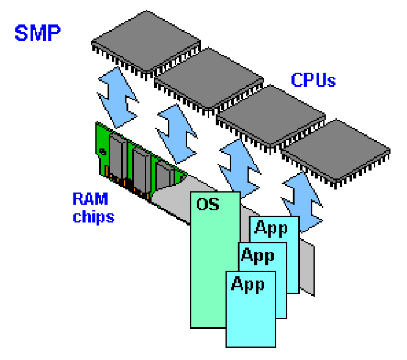
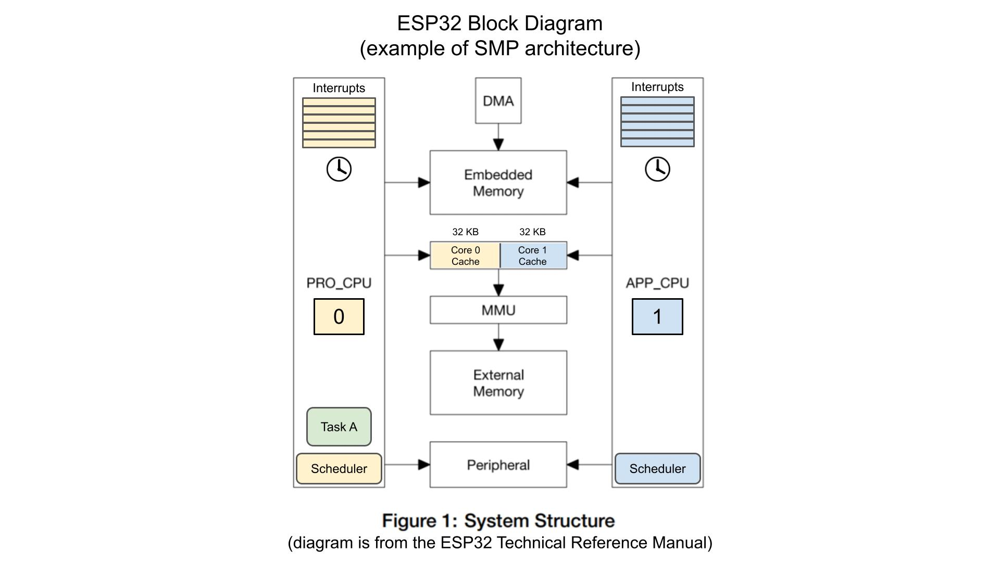
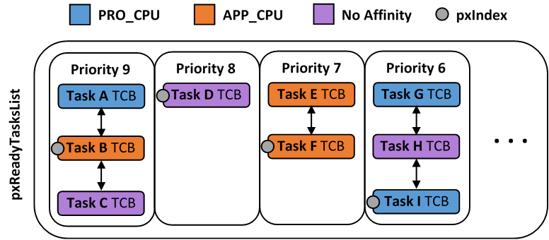

# **Build System and RTOS for ESP32**

## Build System

### 1. Overview

- An ESP-IDF project can be seen as an amalgamation of a number of components
- **ESP-IDF** makes these `components` explicit and configurable.To do that, when a project is compiled, the build system will look up `all the components` in the ESP-IDF directories, the project directories and (optionally) in additional custom component directories.

* A simple project looks like this:

```
myProject/
  |-- build/
  |-- sdkconfig
  |-- Makefile
  |-- components/
  |     |-- component1/
  |     |     |-- component.mk
  |     |     |-- Kconfig
  |     |     |-- src1.c
  |     |-- component2/
  |     |     |-- component.mk
  |     |     |-- Kconfig
  |     |     |-- src1.c
  |-- main/
        |-- src1.c
        |-- src2.c
        |-- Makefile

```

As you can see, a project has a `components/` subdirectory that includes `components` contained in one or more directories and `source files` for the project (default is `main`). After compilation, the project will include a `build` directory that contains all the objects, compiled libraries, and the final output binary file.

- `sdkconfig` project configuration file. This file is created/updated when `idf.py menuconfig` runs
- Component directories each contain a component `Makefile` file, and ít called `component.mk`
- Each component may also include a `Kconfig` file defining the **component configuration** options that can be set via `menuconfig`
- Some components may also include `Kconfig.projbuild` and `project_include.cmake` files

### 2. Using MakeFile

#### Project CMakeLists File

- Minimal project:
  > ```C
  > cmake_minimum_required(VERSION 3.16)
  > include($ENV{IDF_PATH}/tools/cmake/project.cmake)
  > project(myProject)
  > ```
- Optional Project Variables

#### Component CMakeLists Files

### 3. Configuration File

- `Kconfig`
- `menuconfig`
- `Kconfig.projbuild`
- `project_include.cmake`

## RTOS

### 1. Overview

- The original FreeRTOS( Vanilla FreeRTOS) only supports **single core**. In order to use it for **dual core**, we need to use `ESP-IDF FreeRTOS`, which is based on Vanilla FreeRTOS v10.4.3.

### 2. Symmetric Multiprocessing(SMP)

ESP-IDF provides a dual core SMP (Symmetric Multiprocessing).\


- SMP (Symmetric Multiprocessing) is a computing architecture where two or more identical CPUs (cores) are connected to a single shared main memory and controlled by a single operating system.

  - Has multiple cores running independently. Each core has its own register file, interrupts, and interrupt handling.

  - Presents an identical view of memory to each core. Thus a piece of code that accesses a particular memory address will have the same effect regardless of which core it runs on.

#### SMP on an ESP Target

ESP targets (such as the ESP32, ESP32-S3) are dual core SMP SoCs.

- Two identical cores known as CPU0 (i.e., Protocol CPU or **PRO_CPU**) and CPU1 (i.e., Application CPU or **APP_CPU**)
- Cross-core interrupts that allow one CPU to trigger and interrupt on another CPU. This allows cores to **signal each other**.



**NOTE:**

- A thread that is pinned to a particular core will only be able to run on that core
- A thread that is unpinned will be allowed to switch between cores during execution instead of being pinned to a particular core.

### 3. Task

#### **Creation**

In an SMP system, tasks need to be assigned a particular affinity.

- `xTaskCreatePinnedToCore()` creates a task with a particular core affinity. The task’s memory is dynamically allocated.
- `xTaskCreateStaticPinnedToCore()` creates a task with a particular core affinity. The task’s memory is statically allocated (i.e., provided by the user).

The valid values for core affinity are: `PinnedToCore` `xCoreID`

- `0` which pins the created task to CPU0

- `1` which pins the created task to CPU1

- `tskNO_AFFINITY` which allows the task to be run on both CPUs

**NOTE**

- ESP-IDF FreeRTOS still supports the Vanilla FreeRTOS. That means **always tskNO_AFFINITY** every time create( `xTaskCreate()`,`xTaskCreateStatic()`).
- In ESP-IDF FreeRTOS, the task stack sizes are specified in **bytes**. `ulStackDepth`

#### **Deletion**

ESP-IDF FreeRTOS provides the same vTaskDelete() function. However, due to the dual core nature, there are some behavioral differences when calling vTaskDelete() in ESP-IDF FreeRTOS:

- When deleting a task that is pinned to the other core, that task’s memory is always freed by the idle task of the other core (due to the need to clear FPU registers).

- When deleting a task that is currently running on the other core, a yield is triggered on the other core and the task’s memory is freed by one of the idle tasks (depending on the task’s core affinity)

- A deleted task’s memory is freed immediately if…

- The tasks is currently running on this core and is also pinned to this core

- The task is not currently running and is not pinned to any core

The best ways to use `vTaskDelete()` that is only ever called on tasks in a **known state**. For example:

- Tasks self deleting (via `vTaskDelete(NULL)`).
- Tasks placing themselves in the suspend state (via `vTaskSuspend()`) before being deleted by another task.

### 4. Scheduling

- **SMP Scheduler**

  There are several differences in scheduling behavior between `vanilla` and `ESP-IDF FreeRTOS` such as differences in Round Robin scheduling, scheduler suspension, and tick interrupt synchronicity.vTaskSwitchContext()vTaskSwitchContext().

Vanilla FreeRTOS:


ESP-IDF FreeRTOS:



- Therefore when PRO_CPU calls the scheduler, it will only consider the tasks in blue or purple.
- Whereas when APP_CPU calls the scheduler, it will only consider the tasks in orange or purple.

#### **Round Robin Scheduling**

- Although each TCB has an in ESP-IDF FreeRTOS, the linked list of each priority only has a single `xCoreID` `pxIndex`.

- Therefore when the scheduler is called from a particular core and traverses the linked list, it will skip all TCBs pinned to the other core and point the `pxIndex` at the selected task. If the other core then calls the scheduler, it will traverse the linked list starting at the TCB immediately after pxIndex

- Therefore, TCBs skipped on the previous scheduler call from the other core would not be considered on the current scheduler call

This is an example:

> ```
> Processor A: TCB-A1 (priority 1) -> TCB-A2 (priority 2) -> TCB-A3 (priority 3)
> Processor B: TCB-B1 (priority 1) -> TCB-B2 (priority 2) -> TCB-B3 (priority 3)
> ```

Result:

- When Processor A's scheduler is called, it will select the highest priority ready task for its core, which is TCB-A1 (priority 1). It will then execute TCB-A1.
- When Processor B's scheduler is called, it will also select the highest priority ready task for its core, which is TCB-B1 (priority 1). However, since TCB-B1 has already been executed by Processor A, Processor B's scheduler will skip TCB-B1 and select the next highest priority ready task, which is TCB-B2 (priority 2). It will then execute TCB-B2.

#### **Scheduler Suspension**

In ESP-IDF FreeRTOS, `xTaskSuspendAll()` will only prevent calls of `vTaskSwitchContext()` from switching contexts on **the core that called for the suspension**. Hence if PRO_CPU calls vTaskSuspendAll(), APP_CPU will still be able to switch contexts.

**Note**

- In general, it’s better to use other RTOS primitives like mutex semaphores to protect against data shared between tasks, rather than vTaskSuspendAll().

#### **Tick Interrupt Synchronicity**

- In ESP-IDF FreeRTOS, **PRO_CPU** is responsible for incrementing the shared tick count.
- However tick interrupts to each core might not be synchronized (**same frequency but out of phase**) hence when PRO_CPU receives a tick interrupt, APP_CPU might not have received it yet.

**Note**

- Task delays should **NOT** be used as a method of synchronization between tasks in ESP-IDF FreeRTOS. Instead, consider using a counting semaphore to unblock multiple tasks at the same time.

### 5. Critical Sections

- Vanilla FreeRTOS implements critical sections by using `portDISABLE_INTERRUPTS()` which disables the scheduler
- ESP32 has no hardware method for cores to disable each other’s interrupts. Calling `portDISABLE_INTERRUPTS()` will have no effect on the interrupts of the other core

For this reason, ESP-IDF FreeRTOS implements critical sections using special mutexes, referred by `portMUX_Type` objects

|                   | Vanilla FreeRTOS                                                                                                     | ESP-IDF FreeRTOS                                                                                                                               |
| ----------------- | -------------------------------------------------------------------------------------------------------------------- | ---------------------------------------------------------------------------------------------------------------------------------------------- |
| Implements        | by disabling interrupts                                                                                              | using special mutexes                                                                                                                          |
| Section functions | `taskENTER_CRITICAL()`<br>`taskEXIT_CRITICAL()`<br>`taskENTER_CRITICAL_FROM_ISR()`<br>`taskEXIT_CRITICAL_FROM_ISR()` | `taskENTER_CRITICAL(&spinlock)`<br>`taskEXIT_CRITICAL(&spinlock)`<br>`taskENTER_CRITICAL_ISR(&spinlock)`<br>`taskEXIT_CRITICAL_ISR(&spinlock)` |

- Allocating a static spinlock and initializing it using portMUX_INITIALIZER_UNLOCKED

```C
// Statically allocate and initialize the spinlock
static portMUX_TYPE my_spinlock = portMUX_INITIALIZER_UNLOCKED;

void some_function(void)
{
    taskENTER_CRITICAL(&my_spinlock);
    // We are now in a critical section
    taskEXIT_CRITICAL(&my_spinlock);
}
```

- Allocating a dynamic spinlock and initializing it using portMUX_INITIALIZE()

```C
// Allocate the spinlock dynamically
portMUX_TYPE *my_spinlock = malloc(sizeof(portMUX_TYPE));
// Initialize the spinlock dynamically
portMUX_INITIALIZE(my_spinlock);


taskENTER_CRITICAL(my_spinlock);
// Access the resource
taskEXIT_CRITICAL(my_spinlock);
```
